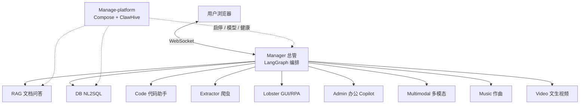

# Agent 开源矩阵 · 14+ 可运行 AI Agent

[](https://gitee.com/assssshuhuhuh/agent/stargazers)
[](https://gitee.com/assssshuhuhuh/agent/members)
[](https://gitee.com/assssshuhuhuh/agent)
[](https://gitee.com/assssshuhuhuh/agent)

> **一套仓库，学完 AI Agent 全家桶。**  
> RAG 知识库 · NL2SQL 问数 · 代码助手 · 爬虫 / RPA · 办公 Copilot · 短视频 / 作曲 · 语音数字人 · 虚拟伴侣 · 校园 / 酒馆 Demo  
> **LangGraph 真编排 + WebSocket 实时会话 + Docker Compose 可部署** — 不是单文件 Demo，是能写进简历、能内网交付的工程矩阵。

觉得有用？右上角 **[Star ⭐](https://gitee.com/assssshuhuhuh/agent/stargazers)**，更新不迷路。

> **说明**：本仓库对外以 **本 README** 为唯一完整介绍。各子目录另有简短 `README.md`（启动方式 / 简历摘要）；详细设计稿与学习长文仅保留在本地，不随仓库推送。

---

## 目录

- [这个仓库是什么](#这个仓库是什么)
- [核心特点](#核心特点)
- [对比优势](#对比优势)
- [谁适合用](#谁适合用)
- [系统架构](#系统架构)
- [5 分钟跑起来](#5-分钟跑起来)
- [子项目详解](#子项目详解)
- [按目标选 Agent](#按目标选-agent)
- [技术栈总览](#技术栈总览)
- [仓库结构](#仓库结构)
- [一键部署](#一键部署)
- [环境与模型](#环境与模型)
- [常见问题](#常见问题)
- [参与贡献](#参与贡献)

---

## 这个仓库是什么

市面上很多「Agent」仓库其实是：**一个 Prompt + 几段 Python + 一篇截图**。  
本仓库不同 —— 它是 **多个可独立运行的专业 Agent**，由 **Manager 总管** 用 LangGraph 编排，对外提供统一 WebSocket 会话入口，并配套 **Manage-platform** 做 Compose 部署与运维控制台。

| 维度 | 本仓库提供什么 |
|------|----------------|
| **规模** | 14+ 专业 Agent + Manager 总管 + Manage-platform 运维平台 |
| **形态** | 每个 Agent 独立目录、独立端口，可单独开发，也可整栈联调 |
| **协作** | 意图路由 → 任务规划 → 下游执行 → 结果合成；支持人工确认（HITL） |
| **落地** | Docker Compose 局域网一键拉起、健康探测、模型配置控制台（ClawHive） |
| **面试 / 简历** | 各子项目 README 含「简历摘要」：技术栈 + 职责亮点，可直接改写 |

一句话：**从「会调大模型 API」进阶到「会做可部署的多智能体系统」。**

---

## 核心特点

### 1. 真·多智能体，不是套壳聊天

- **一个入口，多个专家**：用户只连 Manager；查文档走 RAG，查数走 DB，改代码走 Code，点网页走 Lobster……
- **LangGraph 状态机**：`probe → route → plan → execute → synthesize → critic`，可讲清编排，而不是「一个超级 Prompt 包打天下」
- **子句拆解（可关）**：复杂问句可先拆成多步再路由；需要时可 `MANAGER_CLAUSE_DECOMPOSE=0` 关闭

### 2. 工程化护栏，面向真实业务

- **结构化输出**：Zod / JSON Schema 约束模型产物，减少「自由发挥」
- **高风险人工确认（HITL）**：写库、写文件、GUI 危险动作前可暂停等人点确认
- **只读问数**：DB Agent 侧强调 Schema 接地与只读路径，降低「乱改库」风险
- **受控写盘**：Code Agent 先 Diff 再确认写入，读写分离

### 3. 可拆可合，适合二次开发

- **可拆**：只要企业知识库？带走 `RAG_Agent`；只要 NL2SQL？带走 `DB_Agent`
- **可合**：Manager + 平台 Compose，一条链路演示「总管调度全家桶」
- **端口契约清晰**：每个 Agent 固定默认端口，联调成本可控

### 4. 能部署、能运维，不是 PPT 架构

- **两档 Compose**：标准版（对话 + 问数 + RAG + 代码 + 爬虫 + 办公）/ 完整版（再加多模态、媒体、RPA、监控）
- **ClawHive 控制台**：启停 Agent、改模型、看健康，不必 SSH 改十几份 `.env`
- **三层配置 SSOT**：模型名 / 行为 MODE / 基础设施（端口、Token、API Key）分层，避免巨型单文件配置地狱

### 5. 覆盖面广：从「企业刚需」到「AIGC 体验」

| 层级 | 覆盖 |
|------|------|
| **企业刚需** | RAG 引用问答、NL2SQL、代码助手、爬虫、办公助理 |
| **自动化** | Playwright 结构化采集 + GUI RPA（verify / recover） |
| **多模态 / 创作** | 识图 ASR、MIDI 作曲、短视频混流、语音数字人 |
| **互动 Demo** | 虚拟伴侣小镇、酒馆人格、校园模拟 |

### 6. 适合学习与面试讲述

- **边界清楚**：编排层 vs 专家层，面试官一听就懂
- **可观测**：LangSmith、健康探测、指标脚本、进化看板（Manager）
- **可演示**：5 分钟 Manager+RAG 黄金路径；也可 Compose 全栈演示

---

## 对比优势

| 常见开源形态 | 本仓库 |
|--------------|--------|
| 单文件 ChatBot / Notebook Demo | **多服务架构**，每个 Agent 可独立进程 / 容器 |
| 只会「调 OpenAI」 | **编排 + 工具 + 护栏 + 部署** 一整条链 |
| 只有 RAG 或只有 Agent 框架教程 | **RAG + NL2SQL + Code + RPA + 媒体** 同仓对照 |
| 架构图画得很美，跑不起来 | **Compose + 脚本** 可局域网交付 |
| 文档散落、新手无从下手 | **本 README 自包含介绍** + 各子目录启动说明 |

**适合 Star，如果你正在：**

- 系统学习 LangGraph / 多智能体，需要完整参考实现  
- 准备 AI / 后端 / 全栈面试，缺一个「能讲清楚、能演示」的项目  
- 想做企业知识库、BI 问数、内网 Agent 平台的二次开发底座  
- 想看 AIGC（音乐 / 视频 / 数字人）如何接到总管链路里  

---

## 谁适合用

| 角色 | 你能从这里拿走什么 |
|------|-------------------|
| **学习者** | 先跑 Manager+RAG，再按兴趣深入单个专家 Agent |
| **求职者** | 子目录 README「简历摘要」可直接改写为项目经历 |
| **开发者** | 协议与端口清晰，可单 Agent 嵌入现有系统 |
| **团队 / 内网** | Manage-platform 标准版 / 完整版两档，适合演示与试点交付 |

---

## 系统架构



**三层分工：**

1. **编排层**：`Manager_Agent` — 会话、意图、路由、HITL、合成  
2. **专业能力层**：RAG / DB / Code / Extractor / Lobster / Admin …  
3. **运维层**：`Manage-platform_Agent` — Compose、控制台、监控  

媒体类（识图 / 作曲 / 视频）可由总管直接调用，不强制二次转发。

---

## 5 分钟跑起来

最快体验路径：**Manager + RAG**（上传文档 → 带引用问答）。

```bash
git clone https://gitee.com/assssshuhuhuh/agent.git
cd agent

# 配置 API Key（DashScope 或 OpenAI 兼容）
cd Manager_Agent && npm i && cp .env.example .env
cd ../RAG_Agent && npm i && cp .env.example .env

# 终端 A：RAG  →  http://127.0.0.1:13102
cd RAG_Agent && npm run dev

# 终端 B：总管 →  http://127.0.0.1:13106
cd Manager_Agent && npm run dev
```

**验收标准**

1. 打开 RAG 页面，上传一份 PDF / Word  
2. 打开 Manager，问：「这份文档讲了什么？」  
3. 回答应带**可追溯引用**，而不是空口胡编  

全套局域网一键部署见下方 [一键部署](#一键部署)。

---

## 子项目详解

下面按「定位 → 技术栈 → 核心能力 → 端口 / 启动提示」介绍每个子项目。  
更细的启动命令与环境变量，见对应目录下的 `README.md` 与 `.env.example`。

---

### 1. Manager_Agent — 多智能体总管

| 项 | 内容 |
|----|------|
| **定位** | 整个矩阵的「调度中心」：统一 WebSocket 会话，语义路由与任务规划，调度 10+ 下游专家；**不替代** RAG/DB 等专业能力 |
| **技术栈** | Nuxt 4 · Nitro · LangGraph · OpenAI 兼容 LLM · Zod · LangSmith · WebSocket |
| **核心能力** | 状态机 `probe → route → plan → execute → synthesize → critic`；人工确认 / 取消；经验回放与失败洞察驱动规则进化；Agent 注册表与健康探测；媒体文件同源代理播放 |
| **端口** | **13106** |
| **适合讲** | 「一个入口，多个专家」；为什么用 WebSocket；HITL 与可观测性 |

```bash
cd Manager_Agent && npm i && cp .env.example .env && npm run dev
# http://127.0.0.1:13106
```

---

### 2. RAG_Agent — 私有知识库问答

| 项 | 内容 |
|----|------|
| **定位** | 企业 / 个人私有文档的检索增强生成：**先检索后生成**，回答尽量有据可依 |
| **技术栈** | Nuxt 4 · Vue 3 · LangGraph · langchain · pdf-parse / mammoth · pgvector 或内存向量 · Zod · Tailwind |
| **核心能力** | PDF / Word / TXT 上传解析切块向量化；列表查询 vs 深度问答分流；混合检索；引用溯源；扫描件 OCR 抽取 |
| **端口** | **13102** |
| **边界** | 适合内部资料问答；不适合无文档依据的开放闲聊 |

```bash
cd RAG_Agent && npm i && cp .env.example .env && npm run dev
```

---

### 3. DB_Agent — NL2SQL 自然语言问数

| 项 | 内容 |
|----|------|
| **定位** | 单库自然语言查数：把「人话」变成可执行、可解释的 SQL / 统计路径 |
| **技术栈** | Nuxt 4 · LangGraph · MySQL · 多路径 SQL/统计链 · Zod |
| **核心能力** | 查询链 `repeat → condense → plan → schema_ground → route`；`statistics / sql_plan_direct / sql_direct / sql_agent` 分流；env profile（`low_token | balanced | full`）；反馈学习与路径偏好；与总管 `ask/plan/probe` 协议对接 |
| **端口** | **13101** |
| **提示** | 生产推荐 `balanced`；可用 `DB_AGENT_DOMAIN` 切换域补丁（如养老范例 `p2026` / 通用 `generic`） |

```bash
cd DB_Agent && npm i && cp .env.example .env && npm run dev
```

---

### 4. code_assistent_Agent — 工程化代码助手

| 项 | 内容 |
|----|------|
| **定位** | 面向真实仓库修改的 Coding Agent：**读仓库**与**写仓库**分离，先 Diff 再确认 |
| **技术栈** | Nuxt 4 · Vue 3 · Pinia · Monaco · web-tree-sitter · LangGraph · WebSocket · Vitest |
| **核心能力** | 读结构 / 语义搜索 / 静态分析 / Bug 扫描；重构建议与 Diff；受控写文件；鉴权、限流、审计 |
| **端口** | **13103** |
| **边界** | 不是「聊天框里随口改代码」；强调可审计的工程写盘 |

```bash
cd code_assistent_Agent && npm i && cp .env.example .env && npm run dev
```

---

### 5. Extractor_Agent — 结构化网页采集

| 项 | 内容 |
|----|------|
| **定位** | 把自然语言采集任务拆成可执行计划，输出结构化结果（字段、分页、深度可控） |
| **技术栈** | Nuxt 4 · Nitro · LangGraph · Cheerio · Turndown · Playwright · Zod |
| **核心能力** | HTTP / Playwright / MCP / Skill 多通道；任务规划与质量评分（覆盖率、重复率等）；异步队列；站点 JSON 补丁；Seed-first（总管下发 `seed_urls`） |
| **端口** | **13104** |
| **边界** | 区分静态抽取与动态渲染页；强调 robots、限速、并发控制 |

```bash
cd Extractor_Agent && npm i && cp .env.example .env && npm run dev
```

---

### 6. Lobster_Agent — 网页 GUI 自动化（RPA）

| 项 | 内容 |
|----|------|
| **定位** | 面向复杂交互页的 **规划 → 执行 → 验证 → 恢复** 闭环；偏「操作页面」而非「抓列表数据」 |
| **技术栈** | Nuxt 4 · Vue 3 · Nitro · Playwright · LangGraph · Zod · WebSocket |
| **核心能力** | 候选元素与多级兜底；verify / recover；风控 gate 与高风险确认；截图 / 状态接口；classic / mcp / auto 执行模式 |
| **端口** | **13108** |
| **提示** | 建议从结构清晰的站点练手；生产操作务必开启确认 |

```bash
cd Lobster_Agent && npm i && cp .env.example .env && npm run dev
```

---

### 7. AI_admin_Agent — 办公 Copilot / 个人助理

| 项 | 内容 |
|----|------|
| **定位** | 个人助理型 Agent：任务、日历、笔记、通讯录、邮件分类与回复等办公能力工具化 |
| **技术栈** | FastAPI · SQLAlchemy · LangGraph · React 19 · Vite · Tailwind · HTTP + WebSocket |
| **核心能力** | 办公工具调用；HTTP 聊天与 WS 流式；前后端可分可合；Manager 可传入可信确认参数 |
| **端口** | **13105** |
| **边界** | 工具层边界清晰，便于审计；高风险操作保留确认 |

```bash
cd AI_admin_Agent/backend   # 按目录 README 安装依赖后启动
# 前端见 AI_admin_Agent/frontend
```

---

### 8. Multimodal_Agent — 多模态理解入口

| 项 | 内容 |
|----|------|
| **定位** | 图像 / 视频理解、语音转写、图文问答；生成类请求可重定向到 Music / Video Agent |
| **技术栈** | FastAPI · React (Vite) · Qwen-VL / ASR（DashScope 兼容） · WebSocket |
| **核心能力** | OCR / 情绪 / 描述；视频关键帧 + VL 摘要；ASR（HTTP/WS）；统一入口 `POST /api/multimodal/unified` |
| **端口** | **13107** |
| **边界** | 不内嵌深度作曲 / 视频生成，而是转发到专业 Agent |

---

### 9. Music_Agent — AI 作曲与 MIDI

| 项 | 内容 |
|----|------|
| **定位** | 文本 / 结构化意图生成 MIDI，试听、导出、音色与乐理工具链 |
| **技术栈** | FastAPI · React (Vite) · music21 · FluidSynth · Whisper · Demucs · WebSocket |
| **核心能力** | MIDI / BGM 生成；GM 音色；乐理分析、配和声、乐谱导出；Demucs 分轨；实时阶段事件推送 |
| **端口** | **13110** |
| **边界** | 部分翻唱 / 重演绎能力默认关闭或延后，以当前目录 README 为准 |

---

### 10. Video_Agent — 短视频生成与混流

| 项 | 内容 |
|----|------|
| **定位** | 一句话生成分镜 → 万相文生视频 → 可选接 Music BGM → ffmpeg 混流成片 |
| **技术栈** | FastAPI · LangGraph · React (Vite) · DashScope Wan · httpx · ffmpeg |
| **核心能力** | Director / Camera / Orchestrator 编排；异步任务创建与轮询；调用 Music_Agent；QA 重试节点 |
| **端口** | **13111** |
| **目标体感** | 面向约 10 秒级短视频自动生成链路 |

---

### 11. AI_Agent — 实时语音数字人

| 项 | 内容 |
|----|------|
| **定位** | 麦克风 → ASR → 对话 → TTS → 前端展示的实时虚拟化身 |
| **技术栈** | FastAPI · LangGraph · React/Vite · WebSocket · Qwen3-ASR / TTS · 可选 Ultralight 对口型 |
| **核心能力** | 全双工流水线消息（`transcript` / `reply` / `lip_sync` / `tts_audio` …）；默认 `client_rhythm` **假口型无需 GPU**；可选本地真对口型（GPU + lipsync 微服务） |
| **端口** | 后端常见 **8080**（前端 Vite 另端口，见目录 README） |
| **提示** | 配置以 `AI_Agent/.env` 为准；Docker 通过 `env_file` 挂载，勿把 Key 写进镜像 |

---

### 12. Companion_Agent — 虚拟生活 / 多角色小镇

| 项 | 内容 |
|----|------|
| **定位** | GAL + 多角色小镇：同一世界档里与多位角色聊天 / 约会，独立好感、记忆与对话回退 |
| **技术栈** | React · Vite · TypeScript · FastAPI · WebSocket · LangGraph · Qwen Character · SQLite |
| **核心能力** | 城镇 Hub（日 / 时段 / 心力）；双轨日程与缺席；节日 / 主动消息 / 情绪弧；世界存档；可选桌面 exe |
| **端口** | 后端 **13115** |
| **边界** | 以立绘演出为主（非 Live2D/VRM 强依赖）；改人设后建议新建世界档 |

---

### 13. Tavern_Agent — Agent 酒馆（规则 + LLM 人格）

| 项 | 内容 |
|----|------|
| **定位** | 选「酒品 × 角色」，用**行为参数矩阵**动态生成醉酒人格提示词，并支持插画缓存 |
| **技术栈** | FastAPI · React (Vite) · OpenAI 兼容对话 · 可配置图像生成 · Docker 单容器前后端一体 |
| **核心能力** | 目录 / 矩阵 / 对话 / 图像模块分离；五维行为向量（话痨、情绪、攻击性、文艺、糊涂）驱动提示；平台一键启停 |
| **端口** | **13109**（生产可由 FastAPI 同源托管前端） |
| **边界** | 适合人格化 Demo；不是通用办公助理 |

```bash
cd Tavern_Agent/backend && pip install -r requirements.txt
uvicorn app.main:app --reload --host 0.0.0.0 --port 13109
```

---

### 14. Campus_Agent — 高考前校园模拟

| 项 | 内容 |
|----|------|
| **定位** | 高考前约 100 天的校园模拟向扩展项目（独立玩法环） |
| **技术栈** | FastAPI 后端 + Vite 前端（前后端分离） |
| **核心能力** | 校园世界模拟；冒烟脚本；可选桌面 exe 打包 |
| **端口** | 后端 **13116** · 前端常见 **5176** |

```powershell
cd Campus_Agent/backend
pip install -r requirements.txt
uvicorn app.main:app --reload --host 127.0.0.1 --port 13116

cd Campus_Agent/frontend
npm install && npm run dev
```

---

### 15. Manage-platform_Agent — 一键部署与运维平台

| 项 | 内容 |
|----|------|
| **定位** | 整套 Agent 的 **运维与治理入口**：Compose 编排、ClawHive 控制台、健康总览、可选监控栈 |
| **技术栈** | Docker Compose · ClawHive（前端+后端+PostgreSQL+Redis）· PowerShell / Bash 脚本 · 可选 Prometheus + Grafana |
| **核心能力** | 标准版 / 完整版两档；三层 env SSOT（模型 / MODE / 基础设施）；Agent 启停与模型配置；统一升级 / 重启 / 回滚脚本；Linux 客户机 `install-linux.sh` |
| **端口** | 控制台常见 **18073**（后端等见平台 README） |
| **重要** | 含密钥的实文件勿提交；`CLAWHIVE_INTERNAL_TOKEN` 需与 Manager 侧一致 |

---

### 附：shared — 跨 Agent 共享能力

`shared/` 存放跨子项目复用的公共代码与约定，供本地开发与 Docker 构建注入。单独二次开发某个 Agent 时，请确认是否依赖其中模块。

---

## 按目标选 Agent

| 你想做… | 建议从这里开始 |
|---------|----------------|
| 企业知识库 / RAG 面试题 | `RAG_Agent` + `Manager_Agent` |
| BI 问数 / NL2SQL | `DB_Agent` |
| Cursor 类编程助手 | `code_assistent_Agent` |
| 网页采集 / 爬虫 | `Extractor_Agent` |
| 浏览器 RPA | `Lobster_Agent` |
| 办公 Copilot | `AI_admin_Agent` |
| 短视频 AIGC | `Video_Agent` → `Music_Agent` |
| 数字人 / 虚拟形象 | `AI_Agent` + `Companion_Agent` |
| 人格化互动 Demo | `Tavern_Agent` / `Companion_Agent` |
| 内网一键演示 / 交付 | `Manage-platform_Agent` |

---

## 技术栈总览

| 层级 | 选型 |
|------|------|
| **编排** | LangGraph · OpenAI 兼容 LLM · Zod / 结构化输出 |
| **网关 / 多数前端** | Nuxt 4 · Nitro · Vue · WebSocket |
| **部分子服务** | FastAPI · React · Vite |
| **数据与检索** | MySQL · pgvector · PDF/Word 解析 |
| **自动化** | Playwright（爬虫 + GUI） |
| **媒体** | ffmpeg · music21 / FluidSynth · 文生视频 API |
| **部署** | Docker Compose · ClawHive · 可选 Prometheus / Grafana |
| **可观测** | LangSmith · 健康探测 · 指标与进化看板 |

**设计原则（贯穿全仓）：**

- 业务语义交给模型推理（Function Calling / Zod JSON），避免用关键词表硬编码意图路由  
- 代码层负责工具、状态机、护栏与组装，不「猜用户想干什么」  
- 高风险步骤可暂停等人确认（HITL）  

---

## 仓库结构

```text
agent/
├── Manager_Agent/              # 总管：LangGraph 编排入口（13106）
├── RAG_Agent/                  # 私有知识库问答（13102）
├── DB_Agent/                   # NL2SQL 问数（13101）
├── code_assistent_Agent/       # 代码助手（13103）
├── Extractor_Agent/            # 结构化爬虫（13104）
├── Lobster_Agent/              # GUI / RPA（13108）
├── AI_admin_Agent/             # 办公 Copilot（13105）
├── Multimodal_Agent/           # 多模态理解（13107）
├── Music_Agent/                # 作曲 / MIDI（13110）
├── Video_Agent/                # 短视频生成（13111）
├── AI_Agent/                   # 语音数字人
├── Companion_Agent/            # 虚拟伴侣小镇（13115）
├── Tavern_Agent/               # 人格酒馆（13109）
├── Campus_Agent/               # 校园模拟（13116）
├── Manage-platform_Agent/      # Compose + 控制台（18073）
├── shared/                     # 跨 Agent 共享
├── scripts/                    # 仓库级脚本
└── README.md                   # ← 对外完整介绍（本文件）
```

每个 `*_Agent` 大致包含：**可独立启动的服务 + 前端（如有）+ `.env.example` + 子目录 README（简历摘要 / 启动说明）**。

---

## 一键部署

面向局域网 / 客户机演示：

```bash
cd Manage-platform_Agent
cp .env.agents-lan.example .env.agents-lan
# 编辑：LAN_HOST、API Key、管理员密码、CLAWHIVE_INTERNAL_TOKEN 等

# Linux 客户机
bash scripts/install-linux.sh

# 完整版（多模态 / 音乐 / 视频 / Lobster / 监控）
bash scripts/install-linux.sh --extended
```

Windows 开发机可用 `scripts/up-agents-lan.ps1`（加 `-Extended` 启完整栈）。

| 档位 | 大致内容 |
|------|----------|
| **标准版** | 平台 + Manager + DB / RAG / Code / Extractor / Admin |
| **完整版** | 标准版 + 多模态 / 音乐 / 视频 / Lobster / 监控等 |

验收：浏览器打开 `http://<LAN_HOST>:18073` → 总览健康 → Manager `:13106` 发一条对话。

配置分层、重启与回滚细节见 `Manage-platform_Agent/README.md`。

---

## 环境与模型

- 多数服务支持 **DashScope（百炼）** 或 **OpenAI 兼容** 接口，具体 Key 名见各目录 `.env.example`  
- 本地开发：每个 Agent 各自 `cp .env.example .env` 后填写  
- Compose 场景：优先改平台侧三层 env，再由控制台 / sync 脚本下发，避免手改十几份配置  
- **切勿**把真实 `.env`、Token、客户数据提交进 Git（仓库已忽略 `**/.env`）

---

## 常见问题

**Q：必须把全部 Agent 都启动吗？**  
A：不必。最小体验只需 `RAG_Agent` + `Manager_Agent`；其它按目标按需启动。

**Q：和「Agent 框架教程仓库」有什么区别？**  
A：这里是多服务可运行矩阵 + 编排 + 部署；每个子项目都能单独变成简历上的模块。

**Q：Gitee 上为什么看不到 docs / 学习指南？**  
A：设计稿与长文教程按仓库策略仅本地保留；**对外完整说明以本 README 为准**，子目录 `README.md` 提供启动与简历摘要。

**Q：端口冲突怎么办？**  
A：默认端口见上文各节；可在对应 `.env` / 平台 ` .env.agents-lan` 中调整，并保持 Manager 注册表与实际端口一致。

**Q：适合商用吗？**  
A：可作为内网试点与二次开发底座；正式商用请自行评估模型授权、数据合规、许可证（见文末）与安全加固（鉴权、限流、审计）。

---

## 参与贡献

本项目在 [Gitee · assssshuhuhuh/agent](https://gitee.com/assssshuhuhuh/agent) 持续维护。

1. **Star ⭐** — 让更多人发现这套矩阵  
2. **Fork** — 整仓二次开发，或只带走单个 Agent  
3. **Issue** — 建议标注：`bug` / `增强` / `文档` / `部署`  
4. **PR** — 欢迎补 smoke、修启动说明、改善单 Agent 可读性  

提 PR 前建议：

- 改动尽量落在单一 Agent 或明确的 `shared/`  
- 附上本地复现 / 冒烟步骤  
- 不要提交 `.env`、密钥、`.data/`、构建产物  

---

## 维护说明

- 弃用目录 `Older_Agent` 已移除，能力由 `Multimodal_Agent`（13107）承接  
- 根 `.gitignore` 统一忽略运行时产物与本地设计文档（`docs/`、`**/doc/**`、`学习指南.md` 等）  
- **对外介绍请优先维护本文件**，避免把关键说明只写在不会进 Git 的文档里  

<details>
<summary>分步优化路线图（内部进度，点击展开）</summary>

| 阶段 | 范围 | 状态 |
|------|------|------|
| 1 | 全仓库 `.gitignore` 强化 | ✅ |
| 2 | `Tavern_Agent` | ✅ |
| 3 | `Video_Agent` | ✅ |
| 4 | `Multimodal_Agent` | ✅ |
| 5 | Nuxt 四件套 | ✅ |
| 6 | 升级文档精简 | ✅ |
| 7～10 | Music / Manager / Platform / 跨 Agent 共享 | 进行中 |

</details>

---

## License

许可证文件待补充。使用 / 二次分发前请关注仓库动态，或在 Issue 中询问授权意向。

---

<p align="center">
  <b>不是又一个 ChatGPT 壳子 —— 是能部署、能协作、能写进简历的 Agent 工程矩阵。</b><br/><br/>
  <a href="https://gitee.com/assssshuhuhuh/agent/stargazers">⭐ Star 支持一下</a>
  ·
  <a href="#5-分钟跑起来">5 分钟体验</a>
  ·
  <a href="#子项目详解">子项目详解</a>
  ·
  <a href="#一键部署">一键部署</a>
</p>

<!-- 搜索关键词：AI Agent, 多智能体, LangGraph, RAG, 知识库, NL2SQL, 自然语言查数, 代码助手, 爬虫, Playwright, RPA, 多模态, 数字人, Docker Compose, 开源, 面试, WebSocket, Nuxt, FastAPI, 办公助手, 短视频, MIDI -->
